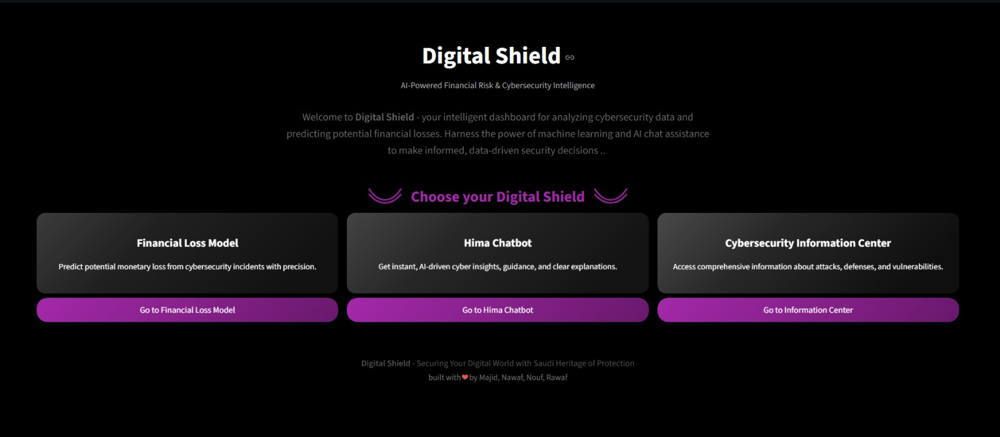
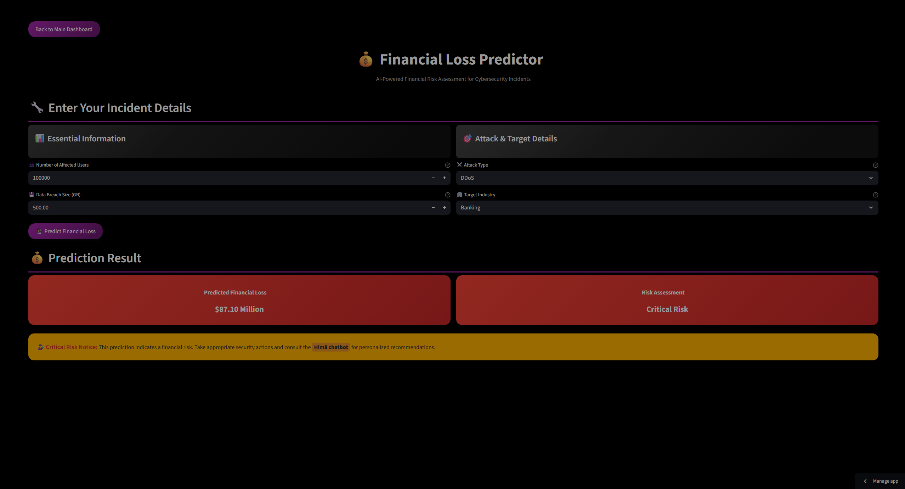
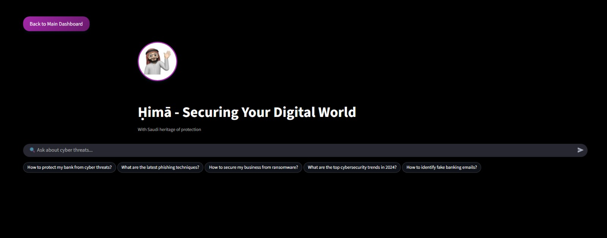
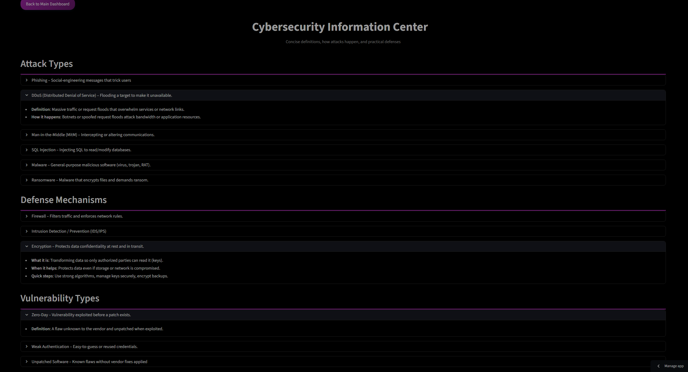

 🛡️ Digital Shield

Digital Shield is an intelligent cybersecurity dashboard that combines data-driven risk analysis with an AI-powered assistant (Hima) to help analysts and decision-makers respond to cyber threats faster and smarter.

---

 🚀 Overview

Digital Shield serves as a **Cybersecurity Information & Decision Support System**, built to simplify complex data and provide actionable insights.  
It integrates **Machine Learning**, **Large Language Models (LLM)**, and **interactive visual analytics** in one unified interface.

---

 🧩 Key Features

 📊 1. Main Dashboard
A real-time overview of all cybersecurity metrics including:
- Attack trends and severity distribution  
- Financial loss analysis  
- Risk levels per region or attack type  

---

💰 2. Financial Loss Model
A predictive model that estimates financial damage based on attack parameters such as:
- Type of attack  
- Target industry  
- Resolution time  
- Number of affected users  

When a high-risk result is detected, the system recommends consulting Hima, the AI cybersecurity assistant, for guidance.

---

 🤖 3. Hima Chatbot (RAG-based Assistant)
Hima is your AI-powered cybersecurity expert.  
It uses Retrieval-Augmented Generation (RAG) to provide accurate, context-aware answers sourced directly from verified datasets — not hallucinations.  

Users can:
- Ask general cybersecurity questions  
- Seek business-specific recommendations  
- Get instant, actionable responses  

---

 🧠 4. Cybersecurity Information Center
A quick-access library of essential security knowledge — all in one place:
- Common attack types  
- Defense mechanisms  
- Known vulnerabilities  

This center helps security teams learn faster and act with clarity during incidents.

---

⚙️ Tech Stack

Frontend / Dashboard: Streamlit, CSS

Backend / API: Python, FastAPI

AI / ML: RAG pipeline (LLM), ChromaDB

Predictive Modeling: XGBoost

---

👥 Team

Majid AlShehri - RAG integration, data preprocessing, and front-end design

Nawaf Alfify - Data preprocessing, cloud integration

Nouf Alhothly - Data preprocessing Frontend development and data visualization

Rawaf Alnajjar -  Data preprocessing , ML model development

---

 🏆 Recognition

🏅 Digital Shield was selected as the Best Project among 16 participating teams in the  
Le Wagon Data Science & AI Bootcamp (2025).

---

📫 Contact

For inquiries or collaboration opportunities:  

🌐 [LinkedIn - Majid AlShehri](https://www.linkedin.com/in/majid-alshehri-42001a312/)
🌐 [LinkedIn - Nawaf Alfify](https://www.linkedin.com/in/nawaf-alfify-8382a9368/)
🌐 [LinkedIn - Nouf Alhothly](https://www.linkedin.com/in/nouf-alhothly/)
🌐 [LinkedIn - Majid AlShehri](https://www.linkedin.com/in/rawaf-alnajjar-899b18263/)

